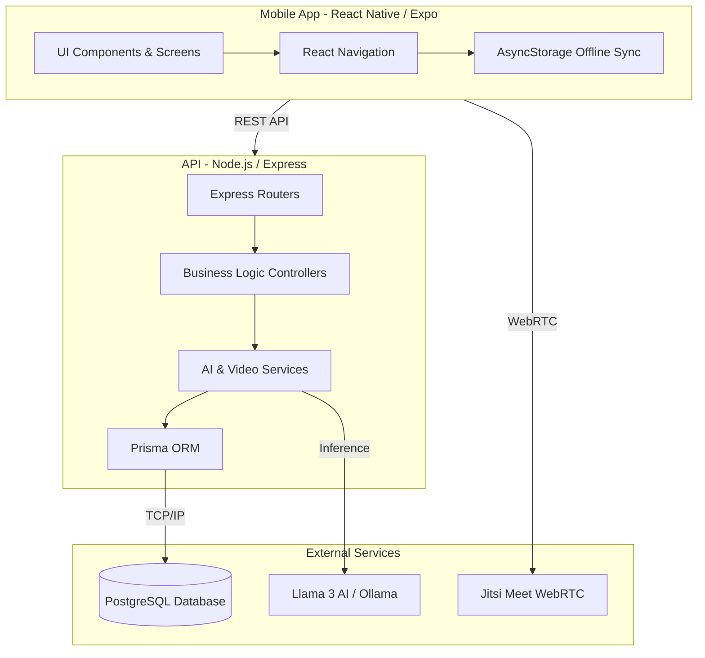

# YouthConnect Health Platform

YouthConnect is an open-source, offline-capable telehealth platform designed to provide accessible sexual and reproductive health (SRH) services for youth. It aims to create a safe, educational, and interactive space where young people can learn about their health, chat with AI nurses, find local clinics, and engage in live teleconsultations.

## Architecture 

The project follows a modern Clean Architecture approach, utilizing a Monorepo structure managed by Turborepo.

### Clean Architecture Diagram



### Components
- **Frontend (`apps/youthconnect-mobile`)**: Built with React Native and Expo. It utilizes `AsyncStorage` for offline queuing and Jitsi Meet for WebRTC teleconsultations. Features a vibrant, youth-friendly White & Blue theme.
- **Backend (`apps/youthconnect-api`)**: Powered by Node.js, Express, and Prisma ORM. Provides secure JWT authentication, integrates with local open-source AI (Llama 3 via Ollama) for chatbots, and manages WebRTC rooms for live teleconsultations.

## Getting Started & Commands

### Prerequisites
- Node.js (v18+)
- npm or yarn
- PostgreSQL
- Expo CLI

### Installation
Clone the repository and install dependencies from the root:
```bash
npm install
```

### Running the Project Locally
To run both the backend API and the mobile app concurrently using Turborepo:
```bash
npm run dev
```

To run them individually:
- **Mobile App**: `cd apps/youthconnect-mobile && npm run start`
- **Backend API**: `cd apps/youthconnect-api && npm run dev`

### Database Setup
To initialize the database and apply Prisma migrations:
```bash
cd apps/youthconnect-api
npx prisma migrate dev
```

## Testing

The platform includes comprehensive automated tests to ensure reliability across all components.

### Running Tests
To run all tests across the monorepo:
```bash
npm run test
```

- **Frontend Tests**: Uses Jest and React Native Testing Library for UI components and navigation logic.
- **Backend Tests**: Uses Jest and Supertest for API endpoint validation, authentication flows, and AI service integration.

To run tests for a specific workspace:
```bash
cd apps/youthconnect-mobile && npm test
```

## License
MIT License
